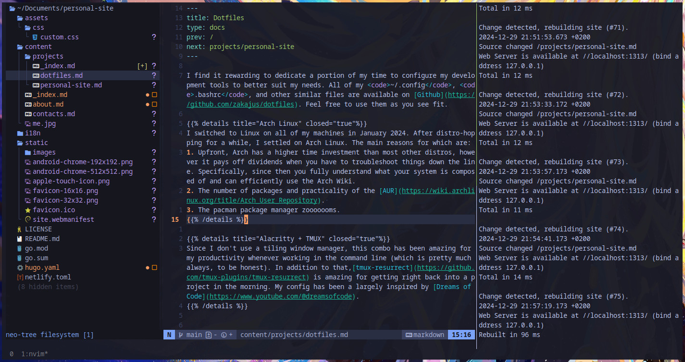

I find it rewarding to dedicate a portion of my time to configure my development tools to better suit my needs. All of my <code>~/.config</code>, <code>.bashrc</code>, and other similar files are available on [Github](https://github.com/zakajus/dotfiles). Feel free to use them as you see fit.

{}
I switched to Linux on all of my machines in January 2024. After distro-hopping for a while, I settled on Arch Linux. The main reasons for which are:
1. Upfront, Arch has a higher time investment than most other distros, however it pays off dividends when you have to troubleshoot things down the line. Specifically, since then you fully understand what your system is composed of and can efficiently use the Arch Wiki.
2. The number of packages and practicality of the [AUR](https://wiki.archlinux.org/title/Arch_User_Repository). 
3. The pacman package manager zooooooms.
{}

{}
Since I don't use a tiling window manager, this combo has been amazing for my productivity whenever working in the command line (which is pretty much always, to be honest). In addition to that,[tmux-resurrect](https://github.com/tmux-plugins/tmux-resurrect) is amazing for getting right back into a project in the morning. My config has been a largely inspired by [Dreams of Code](https://www.youtube.com/@dreamsofcode).
{}

{}
I used to just use VSCode, however after learning Vim motions, I find NeoVim to be a far more smooth experience. My config is based on [Kickstart.nvim](https://github.com/nvim-lua/kickstart.nvim) and is far from perfect, however it works for the time being.
{}

